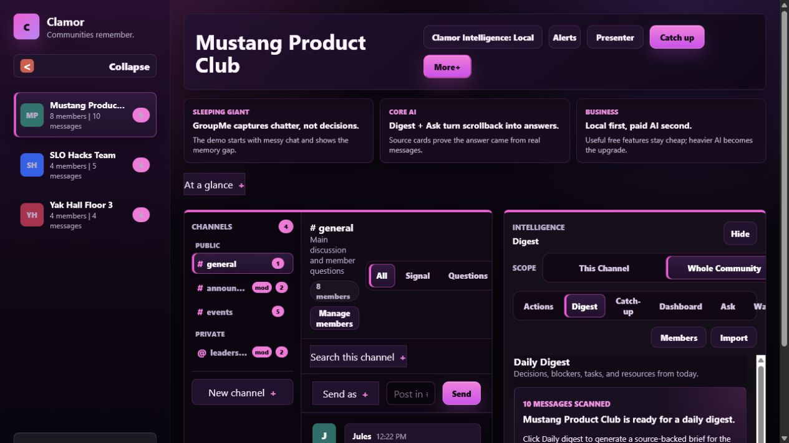
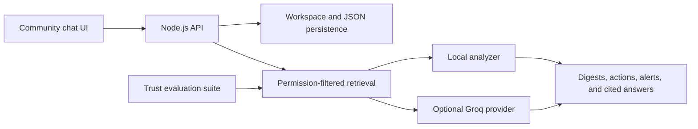

# Clamor

[](https://github.com/IanRmacdonnell/clamor-ai-memory-layer/actions/workflows/ci.yml)
[](https://ianrmacdonnell.github.io/clamor-ai-memory-layer/)

**AI memory layer for student communities that turns noisy group chats into digests, action items, alerts, onboarding briefs, and source-backed Q&A.**



[Live case study](https://ianrmacdonnell.github.io/clamor-ai-memory-layer/) · [Product strategy](https://ianrmacdonnell.github.io/clamor-ai-memory-layer/strategy.html) · [60–90 second demo guide](docs/demo-guide.md)

Clamor is a full-stack product prototype for messy group chats. It keeps the lightweight feel of a GroupMe-style community, then adds structured memory so clubs, student orgs, class groups, and hackathon teams can recover decisions, deadlines, tasks, and context without scrolling forever.

## At a Glance

| Area | Details |
| --- | --- |
| Project type | Full-stack AI product prototype |
| Main objective | Turn fast-moving student community chats into useful memory |
| Core features | Daily digest, source-backed Q&A, action extraction, keyword alerts, onboarding briefs, community health dashboard |
| Tech stack | HTML, CSS, vanilla JavaScript, Node.js, JSON persistence |
| AI approach | Local rule-based analyzer first, optional Groq backend calls for higher-value summaries and answers |
| Best portfolio signal | Product thinking plus full-stack implementation of an AI-assisted workflow |

## Architecture



## About / Examples

Clamor is built around realistic student-community problems where important information gets buried in chat.

Example situations it handles:

- A club officer asks, `What decisions were made about funding?` and gets an answer backed by source messages.
- A new member joins late and uses the onboarding brief to understand recent decisions, deadlines, and context.
- A moderator watches keywords like `sponsor`, `room`, or `deadline` and gets alerted when they appear.
- A team imports messy chat lines and turns them into actions, blockers, deadlines, and shared resources.
- A presenter opens the strategy view to explain the product wedge, market, AI cost model, and demo story.

## Why I Built It

Clamor began as a rapid-prototyping club competition idea. I wanted to build something fun and move quickly, but I also wanted the project to address a real product problem in a large, established category: important context gets lost inside high-volume messaging apps.

Discord and similar tools are great for fast conversation, but decisions, deadlines, resources, and unanswered questions quickly disappear into scrollback. New members repeat questions, action items lose their owners, and useful knowledge becomes difficult to recover.

The competition idea grew into an independent product experiment:

> What if an AI layer could turn a community's chat history into trustworthy, useful memory without asking the community to abandon the messaging tools it already uses?

That question shaped Clamor's digests, action extraction, onboarding briefs, alerts, and source-backed answers. Vibe coding helped me move from idea to prototype quickly; product thinking, retrieval design, and trust evaluation helped me turn the prototype into a more complete system.

## What It Does

- Turns chat history into a daily digest with decisions, blockers, tasks, and resources.
- Answers questions over saved community messages with source cards.
- Extracts action items and deadlines from conversation.
- Watches configured keywords and creates alerts.
- Supports public, private, and moderator-only channels.
- Provides role-aware posting, invites, and member management.
- Includes a presenter/strategy page for explaining the market, cost model, and product wedge.
- Works without an API key using a local analyzer.
- Can use Groq from the backend for higher-value AI calls when configured.

## Skills Demonstrated

- Full-stack product development with frontend state, backend routes, and local persistence.
- AI product design for summaries, Q&A, alerts, onboarding, reports, and explainability.
- RAG-style thinking through scoped retrieval, source-backed answers, and evidence cards.
- UX/UI design for a student-community workflow inspired by chat tools without becoming enterprise-heavy.
- Backend API design for messages, imports, invites, roles, reports, asks, overviews, and reset flows.
- Data modeling for communities, channels, members, roles, invites, messages, actions, alerts, and metrics.
- Product strategy: wedge, market positioning, judge objections, demo story, and AI cost model.
- Cost-aware AI design by using local logic for lightweight analysis and reserving LLM calls for high-value tasks.

## Tech Stack

- Frontend: HTML, CSS, vanilla JavaScript
- Backend: Node.js HTTP server
- Data: JSON seed/store files for prototype persistence
- AI architecture: local fallback analyzer plus optional Groq backend calls
- Deployment: Render-ready `render.yaml`

## Project Structure

```text
.
|-- app.js                  # Frontend state and interaction logic
|-- server.js               # Node backend and API routes
|-- index.html              # Main product interface
|-- styles.css              # Main app styling
|-- strategy.html           # Pitch/strategy page
|-- strategy.css
|-- data/seed.json          # Demo community data
|-- render.yaml             # Render deployment config
`-- package.json
```

## Run Locally

Install Node 18+.

```bash
npm start
```

Then open:

```text
http://localhost:5173
```

If the port is busy:

```bash
node server.js 5174
```

## Optional Groq Setup

Create a `.env` file:

```text
AI_PROVIDER=groq
GROQ_API_KEY=your_key_here
GROQ_MODEL=llama-3.1-8b-instant
```

The API key stays on the backend. If Groq is not configured or fails, the app falls back to the local analyzer.

## Demo Flow

1. Open the product and show the messy student community chat.
2. Open Digest to show decisions, blockers, tasks, and resources.
3. Ask: `What decisions were made about funding?`
4. Point to the source cards that make the answer trustworthy.
5. Open Watch/Alerts to show keyword monitoring.
6. Open Members to show invites and role-aware permissions.
7. Open `strategy.html` to explain the GroupMe wedge, Slack comparison, privacy, and AI cost strategy.

## Trust evaluation

Clamor includes a repeatable trusted-answer baseline covering supported decisions, deadlines, and a question that must be refused because the workspace contains no evidence.

```bash
npm run eval
```

The report measures citation precision and recall, required answer coverage, abstention accuracy, and unsupported-answer rate. The local workspace model also defines Owner, Moderator, Member, and Guest permissions and prevents ordinary members from reading private-channel messages.

The v2 baseline contains 36 direct, unknown, permission-sensitive, and adversarial questions. Permission filtering is applied before both local retrieval and optional provider calls, so hidden messages are not merely removed from the interface—they are excluded from model context.

The implementation sequence is documented in [docs/trust-roadmap.md](docs/trust-roadmap.md).

## What I Would Highlight

Resume version:

> Built Clamor, a full-stack AI community messaging prototype that turns noisy student group chats into structured memory through daily digests, action extraction, keyword alerts, onboarding briefs, and source-backed Q&A.

Technical version:

> Designed a local-first AI intelligence layer that keeps lightweight analysis cheap and reserves LLM calls for high-value summaries, reports, and source-backed answers.

Product version:

> Positioned Clamor as an AI memory layer for campus communities that already rely on GroupMe-style chats but lose decisions, tasks, and context in the message stream.

## Deployment

This project is ready for Render.

Use:

```text
Runtime: Node
Build command: leave blank
Start command: npm start
Health check path: /api/health
```

For a production version, replace JSON storage with Supabase or Postgres so hosted data persists across server restarts.

The static [portfolio case study](https://ianrmacdonnell.github.io/clamor-ai-memory-layer/) is deployed through GitHub Pages. The full application remains Render-ready because its API and persistence layer require a Node runtime.
